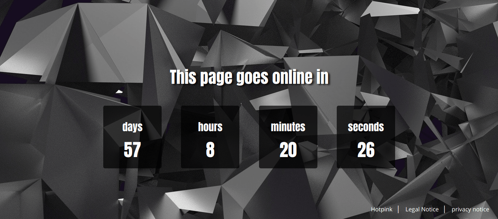

# ComingSoon-Landingpage

Landingpage with Countdown




Preview: [https://hotpink.eu/comingsoon](https://hotpink.eu/comingsoon/)

---

## Step by step instructions
> Linux, Shell, HTML/JS Editor

**1. Create a Git repository** 

**2. npm init**   
```
$ npm init
```   

**3. Install moment.js** 
```
$ npm install moment --save
```

**4. Create and edit .gitignore file**  
with 'Visual Studio Code': 
```
$ code .gitignore 
```  
or with 'vi':
```
$ vi .gitignore 
```
Write _node-modules_ in the .gitignore file

**5. Create a html file and a javascript file**  
(in this example _index.html_ and _assets/js/script.js_)

**6. Integrate js files (your own and moment.js) in your html page**
```
<script src="node_modules/moment/min/moment.min.js"></script>
<script src="assets/js/script.js"></script>
```

**7. Insert for each time unit a div in your HTML document**
```
<div id="days"></div> 
<div id="hours"></div>
<div id="minutes"></div>
<div id="seconds"></div>
```

**8. Write a function in your js file**
```
function countDown() {
};
countDown()
```

**9. Write a function in your js file**
```
let countdownEnd = moment('01-05-2019 09:00:00', 'DD-MM-YYYY HH:mm:ss').unix(),
    currentTime = moment().unix(),
    timeDifference = countdownEnd - currentTime,
    duration = moment.duration(timeDifference * 1000, 'milliseconds'),
    interval = 1000;
```
_statement:_  
```countdownEnd = moment('01-05-2019 09:00:00', 'DD-MM-YYYY HH:mm:ss').unix()``` is the end time of the countdown.   
```currentTime = moment().unix()``` For this code the moment.js is necessary.  
```timeDifference = countdownEnd - currentTime``` Difference between the end time of the countdown and now.  
```duration = moment.duration(timeDifference * 1000, 'milliseconds')``` Time difference in milliseconds  
```interval = 1000;``` 1000ms = 1s; the countdown updates every second

**10. Write an if condition**
```
if (timeDifference > 0) {
}
```

**11. Write this function within the if condition. Here the variables days, hours, minutes and seconds are defined.**
```
setInterval(function () {
    duration = moment.duration(duration.asMilliseconds() - interval, 'milliseconds');
    let days = moment.duration(duration).days(),
        hours = moment.duration(duration).hours(),
        minutes = moment.duration(duration).minutes(),
        seconds = moment.duration(duration).seconds();
}, interval);
```

**12. Output the variables in the HTML file. Write these commands within the if condition at the end (before ```}, interval);```)**
```
document.querySelector('#days').innerHTML = days
document.querySelector('#hours').innerHTML = hours
document.querySelector('#minutes').innerHTML = minutes
document.querySelector('#seconds').innerHTML = seconds
```
---

**13. Of course now you can still style your page.**   
My recommendation: [HTML & CSS: Erfolgreich Websites gestalten und programmieren](https://amzn.to/2HfNJVx)

---

[&copy; Peter R. Stuhlmann Webentwicklung](https://peter-stuhlmann-webentwicklung.de)